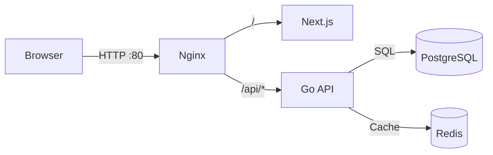

# Novo CRM

Sistema CRM desenvolvido com Go + PostgreSQL + Redis + Next.js/TypeScript + Nginx.

## Estrutura de Repositórios

Este projeto está dividido em 3 repositórios Git separados:

- **[novo_crm_backend](https://github.com/IagoALC/novo_crm_backend)** - API em Go
- **[novo_crm_frontend](https://github.com/IagoALC/novo_crm_frontend)** - Interface em Next.js
- **[novo_crm_infra](https://github.com/IagoALC/novo_crm_infra)** - Infraestrutura e orquestração

## Stack

- **Backend**: Go 1.22+, Gin, GORM, zerolog, Prometheus
- **Frontend**: Next.js App Router, React 19, Tailwind, TypeScript
- **Banco**: PostgreSQL 18.0
- **Cache**: Redis 7
- **Proxy**: Nginx

## Quick Start

### 1. Clonar Repositórios

```bash
mkdir novo_crm && cd novo_crm
git clone git@github.com:IagoALC/novo_crm_backend.git
git clone git@github.com:IagoALC/novo_crm_frontend.git
git clone git@github.com:IagoALC/novo_crm_infra.git
```

### 2. Configurar Ambiente

```bash
cd novo_crm_infra
cp db.env.example db.env
# Ajustar db.env se necessário

cd ../novo_crm_backend
cp env.example .env
# Ajustar .env se necessário

cd ../novo_crm_frontend
cp env.example .env.local
# Ajustar se necessário (opcional)
```

### 3. Subir Serviços

```bash
cd novo_crm_infra
make up
```

### 4. Executar Migrations

```bash
make migrate.up
```

## Acessos

- http://localhost → Frontend
- http://localhost/healthz → Backend health (via nginx)
- http://localhost/api/healthz → Backend health
- http://localhost/api/readyz → Backend readiness (Postgres/Redis)
- http://localhost/api/metrics → Métricas Prometheus

## Comandos Úteis

Todos os comandos devem ser executados no diretório `novo_crm_infra`:

```bash
make up          # Sobe todos os serviços
make down        # Para e remove containers/volumes
make logs        # Visualiza logs
make rebuild     # Rebuild sem cache
make migrate.up  # Executa migrations
make migrate.down # Reverte última migration
make lint        # Lint do backend
make test        # Testes do backend
make api.run     # Roda API localmente (fora do Docker)
```

## Endpoints da API

### Health
- `GET /healthz` → Status básico
- `GET /readyz` → Valida Postgres/Redis
- `GET /metrics` → Métricas Prometheus
- `GET /v1/version` → Versão/commit/built_at

### Autenticação
- `POST /v1/auth/register` → Cria tenant + admin
- `POST /v1/auth/login` → Login (header X-Tenant-ID)
- `POST /v1/auth/refresh` → Renova access token
- `POST /v1/auth/logout` → Revoga refresh token

### Usuários
- `GET /v1/users/me` → Perfil do usuário autenticado
- `GET /v1/users` → Lista usuários (admin)
- `POST /v1/users` → Cria usuário (admin)

## Arquitetura



## Documentação Detalhada

- [Guia de Setup Multi-Repo](MULTI_REPO_SETUP.md)
- [Backend README](https://github.com/IagoALC/novo_crm_backend)
- [Frontend README](https://github.com/IagoALC/novo_crm_frontend)
- [Infra README](../README.md)


